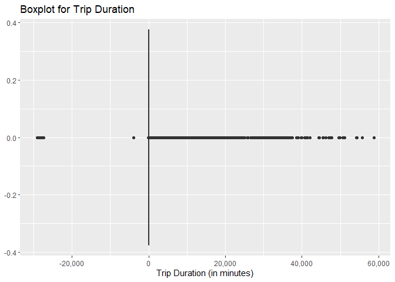
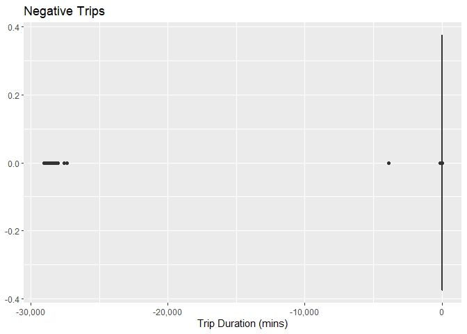

The analysis is a part of a full project that I did for getting qualified for Google Data Analytics certificate. For the purpose, a huge dataset of approximately 500MB was provided. It was too large to be uploaded here. However, this public dataset can be accessed [here](https://divvy-tripdata.s3.amazonaws.com/index.html).

There are 12 `.csv` files for past 12 months, starting from April 2020 till March 2021. These raw data files can be downloaded for data analysis. Due to high volume of these files, I will only attach `.rdata` file format here.

We will jump right to our task with a systematic step-by-step approach.

# Intorduction

Cyclistic Bike Share company's marketing manager is convinced that out of following two categories of riders\
  
\* Casual riders, and  
\* Members
  
Members category is more profitable and it will lead to future growth of the company. For the purpose, marketing manger wants to get aware of major trends for these two classes in order to devise a comprehensive marketing strategy to shift more and more casual riders to members category. A junior data analyst's task is to identify these trends and communicate to the marketing manager in an effective way so that he can build an effective campaign.

# Step-1 - Ask - Define the Business Task

The business task at hand is to increase the number of riders in **Members** category. Following is the business task statement:  
>To find a comprehensive strategy to convert casual riders to members category in order to maximize the prospects of long term growth and profitability of the Cyclistics.

# Step-2 - Prepare - Check the Authenticity and Reliability of Data
In order assess the data, it needs to be looked at. Although, the tool for analysis will be decided in next stage, but before going there, we have to make sure that this data is reliable enough that it has the worth to be analyzed further. We need to check the data for following parameters:
1. Where is the data is located? Since the data is provided by the company itself, and no second party or third party is involved, there is a high probability that data is reliable.
2. How is data organized? Data is organized in `.csv` file format and named in pretty conventional and easy to understand way. name starts with year, followed by month number.
3. Data is reproducible for research purposes.
4. Only primary data sources have been used for this data.


# Step-3 - Process - Start Navigating Through Given Data
Now when we have assessed the quality and source of data and have it downloaded to a secure location, the next step is to make data ready for analysis. Although there are many tools that can help analyze the data, I have used R to explore, analyze and then visualize the given dataset. There are number of reasons for doing so.
1. Data set is too large to manipulate in Excel. While Excel is a wonderful tool to analyze and visualize small-to-medium sized data sets, it has its limitation when it comes to large data sets. Excel can easily be slowed down by any huge dataset. Current data set contains almost 4 million rows and for Excel its too much of a task to go through this rows quickly.
2. Another option is using SQL. No doubt that SQL is much faster than Excel in handling these large data sets, but it needs some external server where data needs to be uploaded and where queries can be run to extract and manipulate data. Due to large size of `.csv` files, it was a challenging task to upload these data files to some external environment like Google Cloud services. These external cloud are exceptionally good with data storage and query execution, but most of the times these services offer limited access with free accounts.
3. Finally, I decided to go with R, not because it's an open source programming platform, but offers great flexibility in terms of manipulating and visualizing data. It's kind of one stop shop where you can perform many task without incurring any cost.

In order to process data before analysis, the first task is to import data into R. To do so, a couple of packages needs to be installed/loaded. You can write the following code to load these libraries:


```r
library(tidyverse) # This package is a combination of different packages required for data wrangling, analysis and visualization.
  
library(lubridate) # This package deals with manipulation of dates.
  
library(scales) # This package helps simplify scales while drawing different graphs and charts.
  
library(cowplot) # This package is helpful if multiple plots are required to be produced or saved side by side.
```

Next we need to import data into R studio to have an initial look of the given data. Due to large size of `*.csv` files, this code will not be executed in following chunks, and, hence will be commented out.  

First step to import these files into R is to get all the names of `*.csv` data files in the folder where these files are stored. Since I used `data/unconditioned_data` folder to download and store these files, I have given the path and used `list.files()` to get the names of all `.csv` files in given folder.


```r
# # get all the file names with their path in a variable ===========
# 
# list_of_files <- list.files("data/unconditioned_data", pattern = "*.csv", 
#                             full.names = TRUE)
# list_of_files
# class(list_of_files)
# length(list_of_files)
```

Before moving further, instead of importing all the files together, its a good practice that we select a single file from above created list and import to check its structure and get a feel of raw data. Again, due to high volume these `.csv` files, this code will not be executed here. We will start our analysis once we get all the data in a single file that is compatible with R and easy to use to manipulate and analyze data.


```r
# # before combining these files, we need to make sure that these files are being
# # combined in the right format. To ascertain the right file structure, import a 
# # a single file into R, and check the variables and define the variable type,
# # if required
# 
# check_file_stru <- read_csv(list_of_files[1])
# str(check_file_stru)
# glimpse(check_file_stru)
# colnames(check_file_stru)
```


As these `.csv` file names are stored as a list in R, the next step is to import these raw `.csv` files into R as as a data frame. As this data frame is still not in compatible R format that we need, this code will also not be executed here. In `read_csv()`, we use `col_types = `, the types of columns that we need in our desired data frame are defined at the time of data import. By doing this, we get all the data in a uniform format that is compatible with each other and will remove and errors in future due to data incompatibility. `col_types` abbreviations represent the following:
* c = `character`
* f = `factor`
* T = `dateTime` of class `POSIXct`
* d = `double`


```r
# # To Combine Data into a Data Frame =======
# 
# # use map_df function to match all the extracted data into a data frame variable
# # in map_df function, '~' is used to define a modified function
# # read_csv() is originally designed to read a single file, but '~' shows that
# # the function has been modified to read a whole list instead of reading a 
# # single file
# 
# tripdata_df <- list_of_files %>% 
#   map_df(~read_csv(.x, col_types = "cfTTccccddddf"))
# tripdata_df
# 
# dim(tripdata_df)
# 
# tripdata_df
```

After import of 12 no. of `.csv` into a single R compatible data frame vector, we need to save it in `.rdata` format. There are several advantages of doing so:
1. It takes less than one-fourth of the original file size.
2. `.rdata` files can be imported easily into `R` Environment and they can be loaded instantly without a requirement of doing any data format conversions.
Now, this master data will be saved as `.rdata` file


```r
# # Save and .Rdata for saving data files ======
# 
# # Use "Save" and ".rdata" extension to reduce storage size of data file
# # efficient write function for csv but takes a fraction (1/4th) of space as compared
# # to write_csv function
# 

# save(tripdata_df, file = "data/master_data.rdata")
```

Finally, we are able to get our hands on a `.rdata` file that can be easily loaded into R environment, so from now on all the code chunks will be compiled and executed. First load `.rdata` file into the system.


```r
# Another advantage of .rdata file is that it can be easily loaded into R
# environment within seconds . This file can be carried anywhere in any other 
# R project, without the need of carrying original bulk spaced .csv files.
# load the .rdata file

load("data/master_data.rdata")

glimpse(tripdata_df)
```

```
## Rows: 3,489,748
## Columns: 13
## $ ride_id            <chr> "A847FADBBC638E45", "5405B80E996FF60D", "5DD24A79A4~
## $ rideable_type      <fct> docked_bike, docked_bike, docked_bike, docked_bike,~
## $ started_at         <dttm> 2020-04-26 17:45:14, 2020-04-17 17:08:54, 2020-04-~
## $ ended_at           <dttm> 2020-04-26 18:12:03, 2020-04-17 17:17:03, 2020-04-~
## $ start_station_name <chr> "Eckhart Park", "Drake Ave & Fullerton Ave", "McClu~
## $ start_station_id   <chr> "86", "503", "142", "216", "125", "173", "35", "434~
## $ end_station_name   <chr> "Lincoln Ave & Diversey Pkwy", "Kosciuszko Park", "~
## $ end_station_id     <chr> "152", "499", "255", "657", "323", "35", "635", "38~
## $ start_lat          <dbl> 41.8964, 41.9244, 41.8945, 41.9030, 41.8902, 41.896~
## $ start_lng          <dbl> -87.6610, -87.7154, -87.6179, -87.6975, -87.6262, -~
## $ end_lat            <dbl> 41.9322, 41.9306, 41.8679, 41.8992, 41.9695, 41.892~
## $ end_lng            <dbl> -87.6586, -87.7238, -87.6230, -87.6722, -87.6547, -~
## $ member_casual      <fct> member, member, member, member, casual, member, mem~
```

We just have to name the `.rdata` file in destination folder to load it by using `load()`, it will create its R variable itself and will be ready to use in seconds. `glimpse()` function is very useful member of `pillar` package and it literally provides an outlook/structure of the given object.  

Although, it's not a requirement, but personally I have found it to be a good practice if we do not operate on our master data frame for data wrangling and manipulation in order to avoid any accidental data over writing on our master data. Therefore, we are going to create a copy of our master data frame. Although, it will take some space but this additional space usage is worth it as this precautionary measure can save our master data from any accidental loss or damage.  


```r
# Make a copy of original dataset to avoid over writing original dataset

df2 <- tripdata_df


# make a new data frame with this information
save(df2, file = "data/df2.rdata")


## Load 'df2' dataset

load("data/df2.rdata")

class(df2)
```

```
## [1] "spec_tbl_df" "tbl_df"      "tbl"         "data.frame"
```


Now when we have our data ready, we need to add some more variables into our data frame for getting this data ready for analysis. 
Since this data set is all about cycle trips, the most important parameter in this data set is the trip duration. We will introduce a new variable with the name of `trip_dur` which will store the total time of each trip. `%--%` is a trip duration calculation operator that is used calculate time when given start and end time in `POSIXct` format.


```r
# Data wrangling ==============

# arrange data with respect to date and time

df2 <- df2 %>% 
  arrange(started_at)

df2
```

```
## # A tibble: 3,489,748 x 13
##    ride_id          rideable_type started_at          ended_at           
##    <chr>            <fct>         <dttm>              <dttm>             
##  1 5DB63F4E4EB6A9CF docked_bike   2020-04-01 00:00:30 2020-04-01 00:23:03
##  2 1FD159E93F7BAFA1 docked_bike   2020-04-01 00:02:35 2020-04-01 00:10:45
##  3 6D93A270684EC452 docked_bike   2020-04-01 00:02:41 2020-04-01 00:24:20
##  4 091D47E4F0FC5022 docked_bike   2020-04-01 00:06:44 2020-04-01 00:14:01
##  5 07F785C9DDA3404C docked_bike   2020-04-01 00:11:18 2020-04-01 00:11:51
##  6 643593E85E46A45C docked_bike   2020-04-01 00:13:36 2020-04-01 00:18:59
##  7 782CEA3C6968D2A6 docked_bike   2020-04-01 00:13:41 2020-04-01 00:19:09
##  8 432C76DCFB84366A docked_bike   2020-04-01 00:21:54 2020-04-01 00:27:20
##  9 7912522A5308E3DA docked_bike   2020-04-01 00:23:52 2020-04-01 00:34:42
## 10 545019BF3EF4B419 docked_bike   2020-04-01 00:39:21 2020-04-01 00:43:19
## # ... with 3,489,738 more rows, and 9 more variables: start_station_name <chr>,
## #   start_station_id <chr>, end_station_name <chr>, end_station_id <chr>,
## #   start_lat <dbl>, start_lng <dbl>, end_lat <dbl>, end_lng <dbl>,
## #   member_casual <fct>
```

```r
# introduce a new column variable that can calculate trip length
# use duration calculation operator to calculate the trip duration

trip_dur <- df2 %>% 
  with(started_at %--% ended_at) %>%
  as.duration() %>% 
  as.numeric("minutes") %>% 
  round(2)

# add this new useful variable to the data frame df2

df2 <- df2 %>% 
  mutate(trip_dur)

glimpse(df2)
```

```
## Rows: 3,489,748
## Columns: 14
## $ ride_id            <chr> "5DB63F4E4EB6A9CF", "1FD159E93F7BAFA1", "6D93A27068~
## $ rideable_type      <fct> docked_bike, docked_bike, docked_bike, docked_bike,~
## $ started_at         <dttm> 2020-04-01 00:00:30, 2020-04-01 00:02:35, 2020-04-~
## $ ended_at           <dttm> 2020-04-01 00:23:03, 2020-04-01 00:10:45, 2020-04-~
## $ start_station_name <chr> "Damen Ave & Wellington Ave", "Wabash Ave & 16th St~
## $ start_station_id   <chr> "162", "72", "162", "173", "321", "74", "74", "240"~
## $ end_station_name   <chr> "Pine Grove Ave & Waveland Ave", "Wabash Ave & 9th ~
## $ end_station_id     <chr> "232", "321", "506", "301", "321", "359", "359", "2~
## $ start_lat          <dbl> 41.9359, 41.8604, 41.9359, 41.8969, 41.8708, 41.893~
## $ start_lng          <dbl> -87.6784, -87.6258, -87.6784, -87.6217, -87.6257, -~
## $ end_lat            <dbl> 41.9493, 41.8708, 41.9171, 41.9080, 41.8708, 41.903~
## $ end_lng            <dbl> -87.6463, -87.6257, -87.7102, -87.6315, -87.6257, -~
## $ member_casual      <fct> casual, member, casual, member, member, member, mem~
## $ trip_dur           <dbl> 22.55, 8.17, 21.65, 7.28, 0.55, 5.38, 5.47, 5.43, 1~
```

```r
summary(df2$trip_dur)
```

```
##      Min.   1st Qu.    Median      Mean   3rd Qu.      Max. 
## -29049.97      7.88     14.52     24.77     26.63  58720.03
```

`smmmary()` of this new variable shows that there is at least one trip duration that is negative, i.e. less than zero. Since, its not possible to have a negative trip duration, so data set needs further investigation. For the purpose, a boxplot will be drawn.


```r
# draw a boxplot to have a clear view of scattered data
# draw a boxplot to have a clear view of trip duration 
ggplot(df2) +
  geom_boxplot(aes(x = trip_dur)) +
  labs(title = "Boxplot for Trip Duration", x = "Trip Duration (in minutes)") +
  scale_x_continuous(labels = scales::comma)
```

<!-- -->

```r
# save this boxplot
ggsave("fig_out/00_0_neg_values_trip_duration.png")
```

```
## Saving 7 x 5 in image
```

As we can see there are number of instances where negative trip duration has been recorded in data. In order to check total number of negative duration values, we will use `filter` to check exact number of these values and their spread.


```r
neg_dur <- df2 %>% 
  filter(trip_dur < 0)
glimpse(neg_dur$trip_dur)
```

```
##  num [1:10552] -0.72 -0.18 -0.02 -0.13 -0.07 -0.33 -0.25 -0.23 -0.02 -0.25 ...
```

We can have a boxplot to check the spread of negative values in our given dataset.


```r
ggplot(neg_dur) +
  geom_boxplot(aes(x = trip_dur)) +
  labs(title = "Negative Trips", x = "Trip Durations (mins)") +
  scale_x_continuous(labels = scales::comma)
```

<!-- -->

As the above mentioned boxplot shows that there are some values that are far away from possible minimum value of time duration i.e. 0 minutes. Let's examine the spread of these neagtive values:

```r
fivenum(neg_dur$trip_dur)
```

```
## [1] -29049.97     -0.42     -0.22     -0.10     -0.02
```
From above summary, we can see that although there are some extreme negative duration values, overall negative value set is skewed towards zero. Therefore, I could remove these negative values, as extreme values are impossible to have as negative trip duration and values close to zero doesn't impact much as there are only around 10,500 negative values out of more than 4 million entries. So I am going to remove these negative values. To do so, a new dataset will be created.


```r
df3 <- df2 %>% 
  filter(trip_dur >= 0 )

save(df3, file = "data/df3.rdata")

load("data/df3.rdata")
glimpse(df3)
```

```
## Rows: 3,479,196
## Columns: 14
## $ ride_id            <chr> "5DB63F4E4EB6A9CF", "1FD159E93F7BAFA1", "6D93A27068~
## $ rideable_type      <fct> docked_bike, docked_bike, docked_bike, docked_bike,~
## $ started_at         <dttm> 2020-04-01 00:00:30, 2020-04-01 00:02:35, 2020-04-~
## $ ended_at           <dttm> 2020-04-01 00:23:03, 2020-04-01 00:10:45, 2020-04-~
## $ start_station_name <chr> "Damen Ave & Wellington Ave", "Wabash Ave & 16th St~
## $ start_station_id   <chr> "162", "72", "162", "173", "321", "74", "74", "240"~
## $ end_station_name   <chr> "Pine Grove Ave & Waveland Ave", "Wabash Ave & 9th ~
## $ end_station_id     <chr> "232", "321", "506", "301", "321", "359", "359", "2~
## $ start_lat          <dbl> 41.9359, 41.8604, 41.9359, 41.8969, 41.8708, 41.893~
## $ start_lng          <dbl> -87.6784, -87.6258, -87.6784, -87.6217, -87.6257, -~
## $ end_lat            <dbl> 41.9493, 41.8708, 41.9171, 41.9080, 41.8708, 41.903~
## $ end_lng            <dbl> -87.6463, -87.6257, -87.7102, -87.6315, -87.6257, -~
## $ member_casual      <fct> casual, member, casual, member, member, member, mem~
## $ trip_dur           <dbl> 22.55, 8.17, 21.65, 7.28, 0.55, 5.38, 5.47, 5.43, 1~
```

We can have a quick summary of both data sets (before and after removal negative values).

```r
summary(df2$trip_dur)
```

```
##      Min.   1st Qu.    Median      Mean   3rd Qu.      Max. 
## -29049.97      7.88     14.52     24.77     26.63  58720.03
```

```r
summary(df3$trip_dur)
```

```
##     Min.  1st Qu.   Median     Mean  3rd Qu.     Max. 
##     0.00     7.93    14.57    27.95    26.68 58720.03
```
Above data confirms that while we successfully removed negative values, it didn't impact much overall data spread or mean. Now we can add some useful new variables (columns) to our data in order to prepare it for further investigation.


